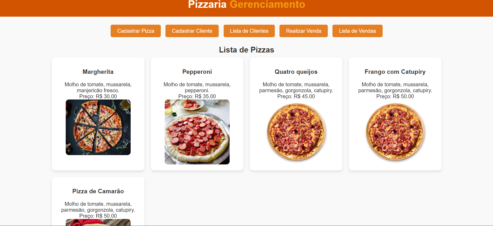
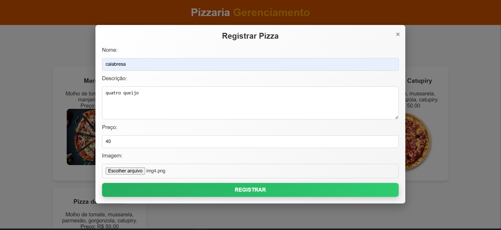
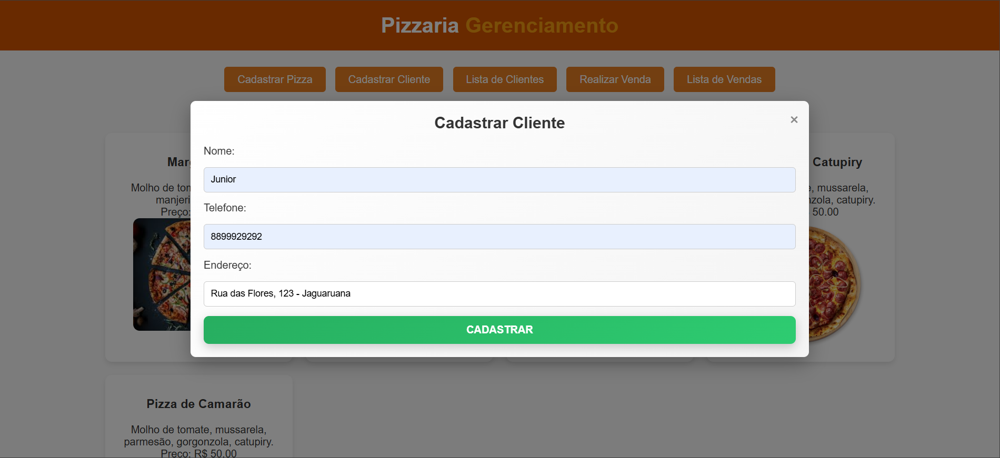
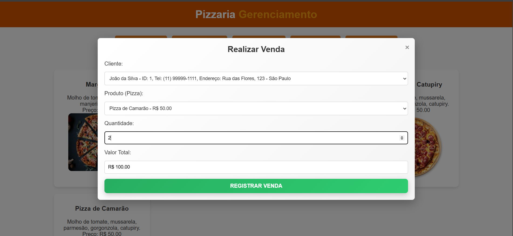
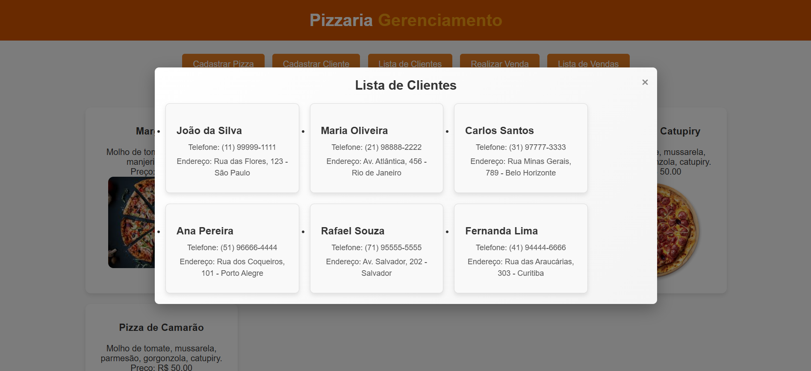
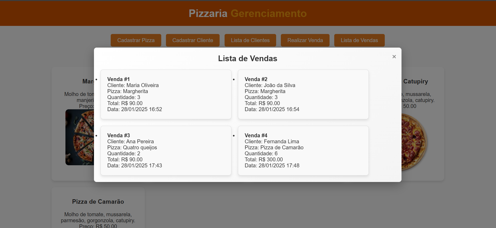

# Pizzaria API

Este é um projeto desenvolvido para gerenciar uma pizzaria, com funcionalidades de cadastro de pizzas, clientes e vendas. A aplicação é composta por uma **API RESTful** construída com **Spring Boot** para o backend e **HTML**, **CSS**, e **JavaScript** no frontend. O sistema permite o cadastro, listagem e gerenciamento de pizzas, clientes e vendas.

## Tecnologias Utilizadas

- **Backend**:
  - **Spring Boot**: Framework para construção de APIs RESTful em kotlin.
  - **Kotlin**: Linguagem de programação para o desenvolvimento do backend.
  - **PostgreSQL**: Banco de dados relacional para persistência de dados.
  
- **Frontend**:
  - **HTML**: Estruturação da página web.
  - **CSS**: Estilo e formatação das páginas web.
  - **JavaScript**: Lógica e interatividade no frontend.

- **Ferramentas**:
  - **IntelliJ IDEA**: IDE utilizada para o desenvolvimento do projeto.

## Funcionalidades

### Cadastro de Pizzas

O sistema permite o cadastro de pizzas com informações como nome, preço e ingredientes. A pizza pode ser listada com todos os seus dados.

### Cadastro de Clientes

Os clientes podem ser cadastrados com informações como nome, e-mail e telefone. Também é possível visualizar a lista de clientes cadastrados.

### Vendas

- As vendas são registradas com o cliente e a pizza escolhida.
- A quantidade de pizzas também é definida na venda.
- O valor total da venda é calculado automaticamente com base no preço da pizza e na quantidade.

### Listagem de Pizzas, Clientes e Vendas

O sistema permite visualizar a lista de todas as pizzas, clientes e vendas cadastradas.

